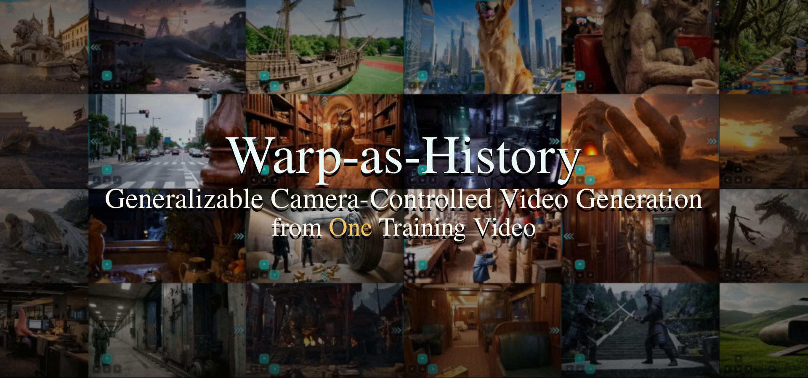

# Warp-as-History

This repository provides the official implementation of Warp-as-History. Our method enables near real-time camera trajectory following and viewpoint manipulation, similar to HappyOyster and Genie 3, using only a single camera-annotated training example.
